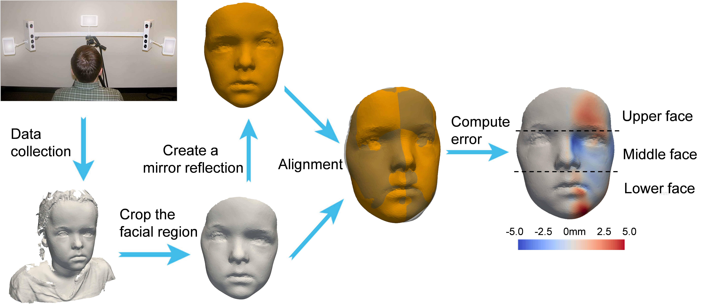

Official implementation of the proposed software for 3D facial asymmetry measurement mentioned in the publication entitled: 

Automated three-dimensional analysis of facial asymmetry in patients with syndromic coronal synostosis: A retrospective study

Link to paper: https://doi.org/10.1016/j.jcms.2023.11.006




## Install
--Install Python 3.6+, and create a virtual environment

```
python3 -m venv 3dfa
```

--Download the scripts
```
cd existing_repo
git remote add origin https://github.com/tsingmessage/3D_facial_asymmetry.git
git branch -M main
git push -uf origin main
```

--Activate the virtual environment, and install requirements.txt by running
```
source 3dfa/bin/activate
pip install -r requirements.txt
```


## customize for the paths

edit main.py to change the input path of your input face mesh file, and the output path

## run the software method
run man.py


## check the results
results should be available in your customized output path, including a face heatmap diaplaying the facial asymmetry, and a table showing the facial asymmetry value of each face mesh file

